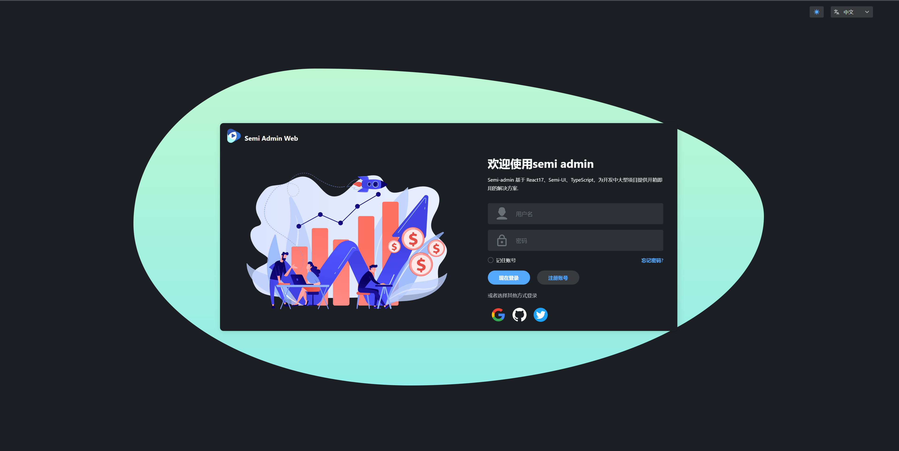

# 简介

`semi-design-admin`是一款开源免费且开箱即用的中后台管理系统模版。使用了最新的 `React`、`Semi-ui`、`TypeScript`、`Zustand`、`Tailwindcss` 等主流技术开发
 ### 主要功能
- 中英切换
- 暗黑模式
- 常用组件封装
- 权限管理
# 技术栈

- [node](http://nodejs.org/) 和 [git](https://git-scm.com/) -项目开发环境
- [create-react-app](https://create-react-app.dev/docs/getting-started)- 构建工具
- [React](https://zh-hans.reactjs.org/) - 熟悉 React jsx 基础语法
- [TypeScript](https://www.typescriptlang.org/) - 熟悉`TypeScript`基本语法
- [Es6+](http://es6.ruanyifeng.com/) - 熟悉 es6 基本语法
- [react-router](https://reactrouter.com/en/main) - 熟悉 react-router 基本使用
- [semi-design](https://semi.design/zh-CN/) - semi ui 基本使用
- [zustand](https://github.com/nuysoft/Mock) - 熟悉 状态管理插件
- [react-transition-group](https://reactcommunity.org/react-transition-group/) - React动画插件
- [Animate.css](https://animate.style/) - 动画库
- [Tailwindcss](https://tailwindcss.com/) 一个功能类优先的 CSS 框架
- [React icons](https://react-icons.github.io/react-icons) 图标库

## 预览
### 线上地址：[semi-design-admin 预览站](http://www.linzijian.top:3100/login)
不需要填写用户名密码

